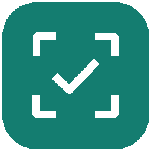
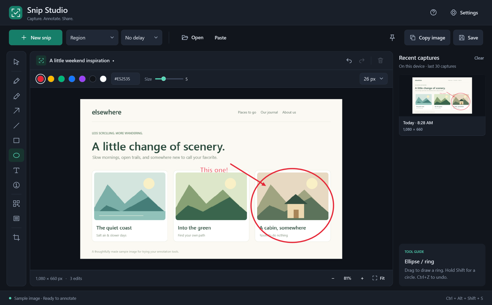
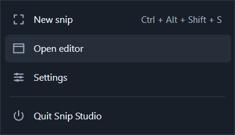

<p align="center">
  
</p>
<h1 align="center">Snip Studio</h1>
<p align="center">Capture the moment. Make your point.</p>
<p align="center">A native Windows snipping tool with a calm dark workspace, instant capture,<br>and the annotation tools you actually reach for.</p>
<p align="center">
  <a href="https://github.com/obammerdev/snip-studio/releases/latest/download/SnipStudio-Setup.exe"></a>
</p>
<p align="center">
  <a href="https://github.com/obammerdev/snip-studio/releases/latest">All downloads</a> ·
  <a href="docs/guide.md">User guide</a> ·
  <a href="https://github.com/obammerdev/snip-studio/issues/new/choose">Report an issue</a>
</p>
<p align="center">
  <a href="https://github.com/obammerdev/snip-studio/actions/workflows/build.yml"></a>
  
  <a href="LICENSE"></a>
</p>



## Get started

1. Download and run **[SnipStudio-Setup.exe](https://github.com/obammerdev/snip-studio/releases/latest/download/SnipStudio-Setup.exe)**.
2. Choose whether to launch at Windows sign-in and add a desktop shortcut.
3. Open Snip Studio, then press **Ctrl + Alt + Shift + S** to capture an area instantly.

The installer includes everything needed to run the app. No .NET download, account, or administrator access is required. Windows 10 version 2004 or later, or Windows 11, on an x64 PC.

Prefer an executable you can keep in a folder? Download the **[portable ZIP](https://github.com/obammerdev/snip-studio/releases/latest/download/SnipStudio-Portable-win-x64.zip)**, extract it, and open `SnipStudio.exe`. Both editions keep preferences and recent captures in your Windows user profile.

Releases are currently unsigned, so Windows may show an unknown-publisher or SmartScreen prompt. Download from this repository's Releases page; SHA-256 checksums accompany every release.

## A small tool with room to work

| Capture | Annotate | Keep things moving |
| --- | --- | --- |
| Region, window, screen, or all displays | Pen and highlighter | Copy image with **Ctrl + C** |
| Selections across monitor boundaries | Arrows, lines, rectangles, and rings | Save as PNG, JPEG, or BMP |
| 3, 5, or 10-second countdown | Text labels and numbered steps | Undo and redo with familiar shortcuts |
| Configurable instant global shortcut | Pixelation, solid redaction, and crop | Paste, open, or drop an image |
| Optional mouse pointer capture | Saturated colors and adjustable widths | Local history and pin-on-top images |

The global shortcut **always skips the countdown**, including one already in progress. Set your preferred shortcut in **Settings**; unavailable combinations are detected before replacing the current one.

## Ready in the tray



Enable **Launch when I sign in to Windows** during setup or in Settings. Snip Studio starts quietly in the tray, ready for your shortcut. Closing the editor keeps capture available; **Ctrl + Q** quits completely. Double-click the tray icon to return to the editor.

While hidden or minimized, the app releases recent-capture previews after a short idle period. Your open image and undo/redo stay available when you return.

Software rendering keeps the default memory footprint smaller. For unusually large images, optional hardware acceleration is available in **Settings → Performance**; quit and reopen after changing it.

Capture selection uses a cached native preview so dragging stays responsive across monitors, independently of the editor's acceleration setting.

To update, quit the app and run the new installer. Startup preferences, captures, and settings are preserved. Uninstall from Windows **Installed apps**; your saved images and settings remain in `%LOCALAPPDATA%\SnipStudio`.

## Local by design

No accounts, analytics, advertising, or image uploads. Captures and settings stay on your computer. History holds the latest 30 captures by default and can be changed, paused, or cleared in the app.

Use **solid redaction** to cover sensitive details before sharing. Exported and copied images contain the flattened result. See the [user guide](docs/guide.md) for editing behavior and privacy details.

## Build and contribute

Requires Windows and the [.NET 10 SDK](https://dotnet.microsoft.com/download/dotnet/10.0).

```powershell
.\build.ps1 -Test             # Build and test on an interactive Windows desktop
.\build.ps1 -Installer        # Installer, portable ZIP, and checksums in release/
```

Installer builds download a verified, project-local Inno Setup compiler when needed. No global compiler installation is required.

[Build and release guide](docs/development.md) · [Contributing](CONTRIBUTING.md) · [Changelog](CHANGELOG.md)

Scrolling capture, OCR, screen recording, and HDR tone mapping are not included yet. Window capture uses visible desktop pixels, so overlapping windows remain visible. For display and editing details, see the [full guide](docs/guide.md).

Licensed under [MIT](LICENSE). Built with C#, WPF, and Windows APIs. See [third-party notices](THIRD-PARTY-NOTICES.md).
